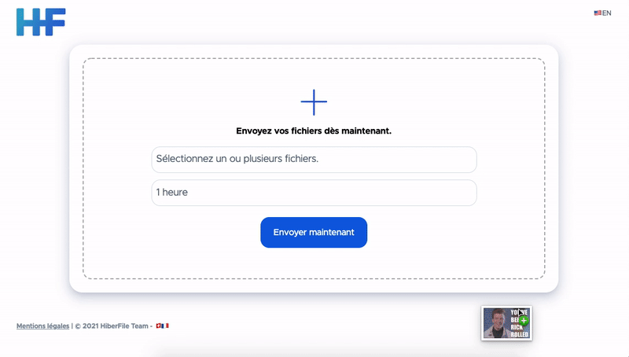

<p align="center">
  
</p>

<p align="center">
  <a href="https://github.com/hiberfile/hiberfile/stargazers"
    ></a>
  <a href="LICENSE"
    ></a>
  <a href=""
    ></a
  ><br />
  <a href="https://twitter.com/HiberFile"
    ></a>
</p>

<p align="center">
  <a href="https://hiberfile.com">Website</a>
  ·
  <a href="#🚀-quick-start">Quick start</a>
</p>

<h1></h1>



**Free, open source and privacy friendly file host.**

<a name="🚀-quick-start"></a>

## ❓ Why

We created HiberFile to make it easy for casual users to share large files (up to 20GB). HiberFile is a free, convenient, fast and secure platform.
## 🚀 Quick start

### Prerequisites

- [Node.js and npm](https://nodejs.org/en/download/) installed on your computer.

### Getting Started

1. Clone the repository:

   ```sh
   git clone https://github.com/hiberfile/hiberfile.git
   ```

2. Install dependancies:

   ```sh
   cd hiberfile && npm install
   ```

3. Launch the dev server (optional):

   ```sh
   npm run dev
   ```

4. Build and deploy:

   ```sh
   npm run build && npm run generate && npm run start
   ```

## 🤝 Contributing

If you are interested in helping contribute to **HiberFile**, feel free to open a pull request.

If you are fluent in a non-English or non-French language, we greatly appreciate any help translating our website in other languages.

### Code Contributors

<!-- This project exists thanks to all the people who [contribute](https://github.com/hiberfile/hiberfile/graphs/contributors). -->

<a href="https://github.com/hiberfile/hiberfile/graphs/contributors">
  
</a>

## 📝 License

© 2021 HiberFile Team

This project is [GPL-3.0](https://github.com/hiberfile/hiberfile/blob/master/LICENSE) licensed.
